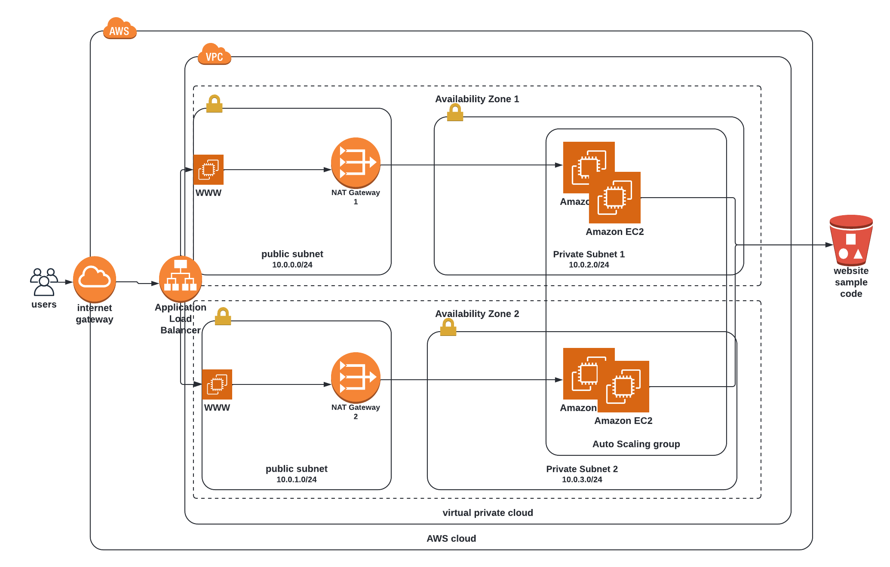

# Deploy and Configuring a High-Availability Web App using CloudFormation

## High Level Design

- - - -
## Design Configuration :

#### Code is separated into two stacks 
- **network** stack that containt network components such as **VPC, Internetgataway, Subnet, EIP, NatGateway, Routing**.

- **Servers** stack that contain **ec2 LB, scale groups, launch configuration, load balancer, TargetGroup**.